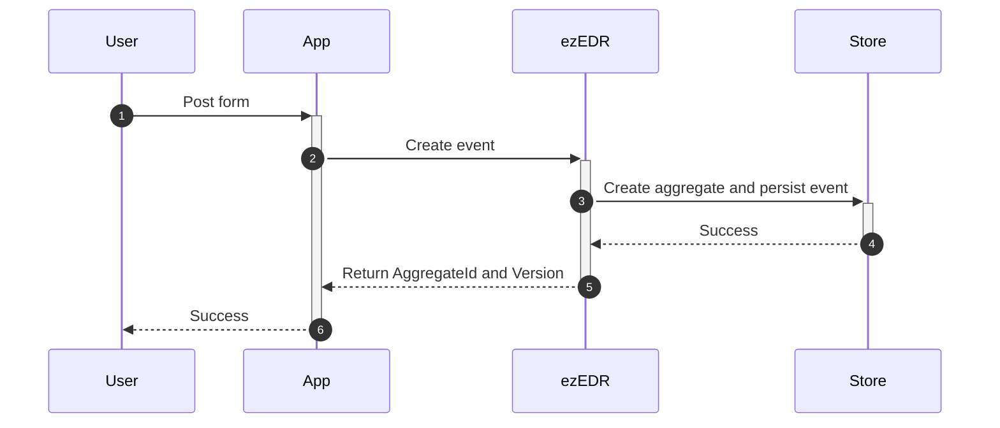

# ezEDR

**ezEDR is a drop in solution for quickly getting started with event sourcing.**

The source code of this project can be found
[here](https://github.com/jaklec/ezEDR).

## Why ezEDR?

Event sourcing is a design pattern where the application state is stored as a
series of events in an _append only_ log, rather than in a mutable store as it
is done in other models such as regular CRUD applications. This has a few
benefits over the traditional approach.

When the system is designed right, almost no logic is taking place before any
event is written to the log. The log is the _source of truth_ and the state is
calculated from this source _after_ it has been persisted.

This means that

- the state of the system, and it's history, is very transparent. It is easy to
  understand why some aggregate has reached a particular state. The system
  becomes easy to debug!
- we can replay all events to rebuild the current state. This means that we can
  add new business logic to historical events. We can even correct bugs and
  replay the entire system. The system becomes more future proof and even has
  some self healing aspects.
- we get audit logging for free!
- business logic tends to end up in the service layer rather than in the
  database layer. The business logic, which probably is your most important
  code, ends up in our version control where it should be. Testing important
  logic thereby becomes a lot easier and (arguably) more fun to code!

There are however some drawbacks as well. In particular, setting up event
sourced systems can be difficult, often requires more upfront design decisions
in the beginning and the time to "get something working" may be significantly
longer that with other approaches. **This is what ezEDR is trying to solve!**

## How it works

ezEDR is an event store for aggregates. Events are stored with an `AggregateId`
and a `Version`. The system will guarantee that the combination of the
`EventName`, the `AggregateId` and the `Version` is unique. This leaves room for
a lot of flexibility when designing a system for end users.

### Example

Alice and Bob are working with a system where they are registering customers for
their company. The system is using ezEDR under the hood.

#### Register a new aggregate

Alice begins her day with registering a new customer. To do that she fills in a
form with the customer's _name_, _address_ and _phone number_ and hits the _Save_
button. This will trigger a sequence of actions:

1. Fill in form and hit **Save** button
2. Post event **CUSTOMER_CREATED**
3. Try to persist event with `EventName=CUSTOMER_ADDRESS_CREATED`, `AggregateId=123` and
   `Version=0`
4. Success
5. Return the `AggregateId` and `Version`
6. Success

The store now have one record with

| AggregateId |      Event       | Version |                        Data                         |
| :---------: | :--------------: | :-----: | :-------------------------------------------------: |
|     123     | CUSTOMER_CREATED |    0    | `name:John Smith;street:John's Avenue;phone:123456` |

#### Update/patch aggregate

Alice now realize that she added the wrong phone number. It has to be updated!

1. Alice updates the field
2. The app creates the event **CUSTOMER_PHONE_NUMBER_UPDATED** with the value
   23456 and posts that to ezEDR
3. ezEDR persists the event based on the current version, which is now 0
4. The event is successfully persisted and the version is incremented to 1
5. ezEDR returns the new version number along with the `AggregateId`
6. The app responds back to Alice that the action was successful.

The store now contains two records

| AggregateId |             Event             | Version |                        Data                         |
| :---------: | :---------------------------: | :-----: | :-------------------------------------------------: |
|     123     |       CUSTOMER_CREATED        |    0    | `name:John Smith;street:John's Avenue;phone:123456` |
|     123     | CUSTOMER_PHONE_NUMBER_UPDATED |    1    |                   `phone:234567`                    |

#### Read an aggregate

Bob is also working with the same customer. He opens the customer page to read
the customer aggregate:

1. Bob requests the aggregate with `AggregateId=123`
2. The propagates this command to ezEDR
3. ezEDR fetches all events associated with the aggregate
4. The storage backend returns the events
5. The app is reducing all the events to one aggregated view. **This is we expect
   to find most of the business logic.**
6. Return the aggregated view where to Bob.

The current state of the aggregate and the aggregated view in this example is now
`name: John Smith;street:John's Avenue;phone:234567`.

#### Concurrent updates

Alice and Bob now both have a view of the aggregate (customer address) with
`Version=1` in front of them. Alice realize that she has forgot to add John's
middle name, which is Allen. At the same time Bob notice that the address is
missing the street number, which is 12. They both updates the value at the same
time.

When Alice is updating the customer name an event called
**CUSTOMER_NAME_UPDATED** is created by the app and posted to ezEDR with
`Version=1`. At the same time the app is creating the event
**CUSTOMER_STREET_UPDATED** with `Version=1` from Bob's update.

One request must hit the server before the other, so let us suppose that Alice's
request won the race. Whoever got first in this case doesn't matter. Both
requests will succeed, _even though Bob's request is based on an outdated
version_, since **ezEDR only leaves the guarantee that the
combination of `AggregateId`, `EventName` and `Version` must be unique**. This
is exactly what we want! If we play our cards right, we will have a system
with optimistic concurrency that is very tolerant to change at a very low risk
of conflicts due to updates. This will make our users happy.

The app will in this case receive a response with `AggregateId=123` and
`Version=2` from Alice's request and a response with `AggregateId=123` and
`Version=3` from Bob's request.

The current state is now

| AggregateId |             Event             | Version |                        Data                         |
| :---------: | :---------------------------: | :-----: | :-------------------------------------------------: |
|     123     |       CUSTOMER_CREATED        |    0    | `name:John Smith;street:John's Avenue;phone:123456` |
|     123     | CUSTOMER_PHONE_NUMBER_UPDATED |    1    |                   `phone:234567`                    |
|     123     |     CUSTOMER_NAME_UPDATED     |    2    |               `name:John Allen Smith`               |
|     123     |    CUSTOMER_STREET_UPDATED    |    3    |              `street:John's Avenue 12`              |

### Conclusion

> The combination of `AggregateId`, `EventName` and `Version` must be unique!

This leads to the following properties if ezEDR:

- Optimistic concurrency with low risk of conflicts
- A gap in the version sequence (e.g. caused by a conflict) doesn't matter since
  updating an aggregate based on an old version is fine as long as the guarantee
  by ezEDR is satisfied.
